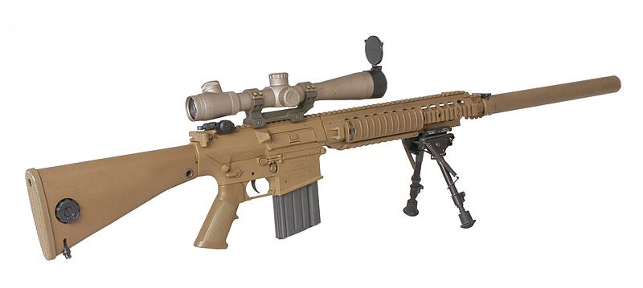
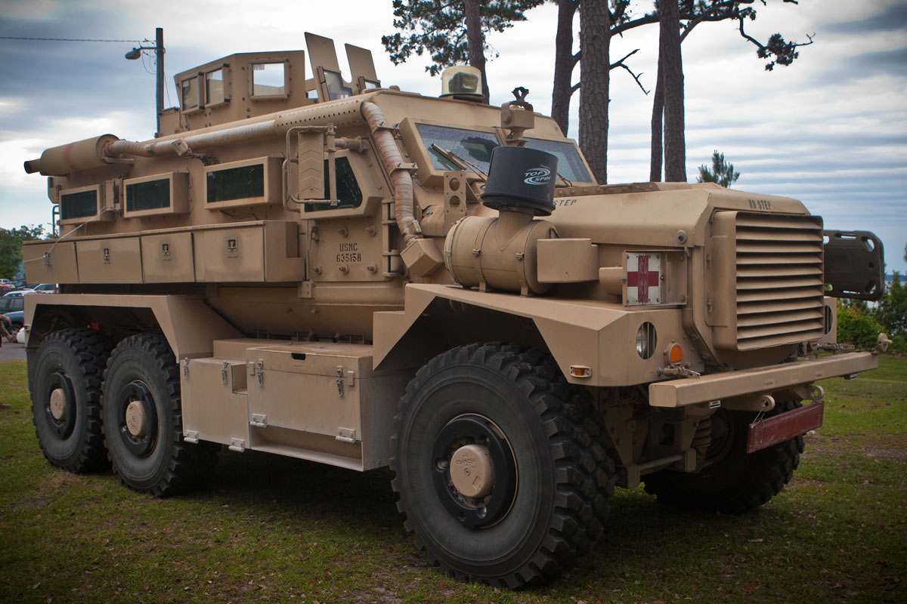
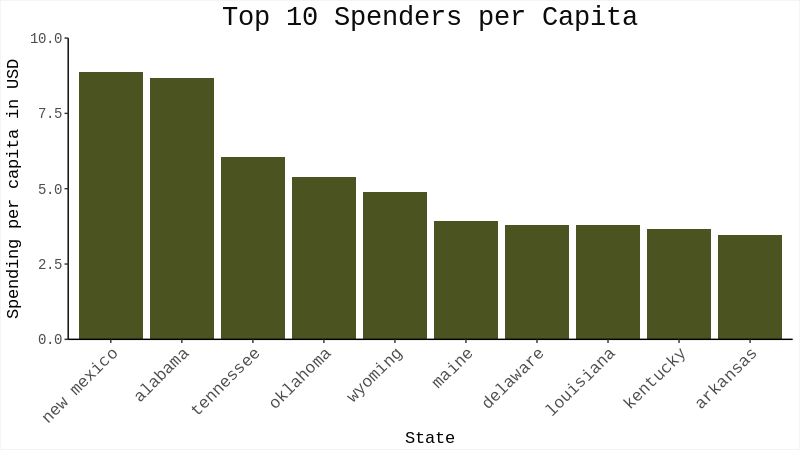
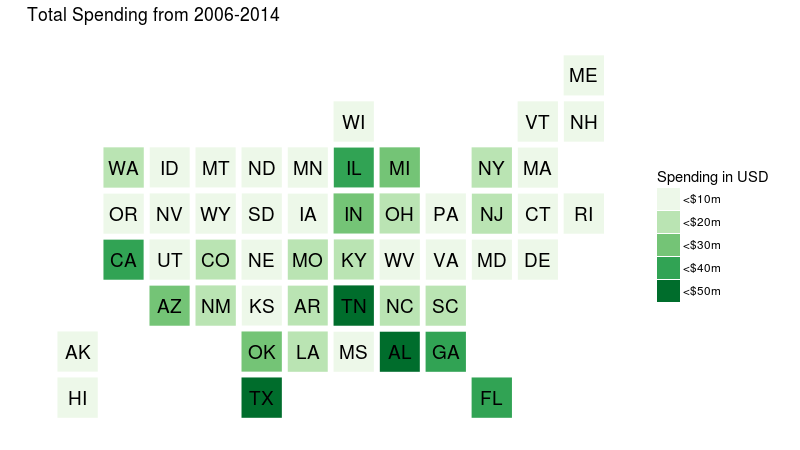

The United States Defence Department's [1033 program](https://en.wikipedia.org/wiki/1033_program) began in 1997, it allows for the transfer of excess military equipment to civilian law enforcement agencies. Most of the equipment obtained is justifiable, things such as cold weather clothing, diesel generators and flashlights. However, a significant portion of it is explicitly combat-oriented in nature, equipment such as M-16 rifles, tanks, and mine-resistant vehicles.  

In 2014 the New York Times filed a freedom of information act request and received data from the Pentagon on all acquisitions since 2006. The data was made public by the NYT, it can be found [here](https://github.com/TheUpshot/Military-Surplus-Gear). The data is on an item purchase level, it has the state and county an item was purchased in, the item's [NATO stock number](https://en.wikipedia.org/wiki/NATO_Stock_Number), the item's name, how much it costs, how many were bought and the date of purchase.

Out of all of money spent by civilian law enforcement agencies through the 1033 program from 2006-2014 **$609,879,850**, **48%** of the total, was spent on combat-oriented equipment. The rest of this analysis was produced using the combat-oriented subset. To see how this subset was derived see the [R source code]() for this analysis.

## Some Notable Acquired Items 

  
Combat Wheeled Vehicle  
98 aquired  
$45,080,000 total  
  
  
6.65mm Rifle  
61,548 acquired  
$30,712,452 total     
   
   
7.62mm Rifle  
17,726 aquired  
$2,446,188 total  
  
  
Mine Resistant Vehicle  
341 acquired  
$140,492,000 total  
   
  
Truck/Van  
173 acquired  
$25,206,100 total  
  
  
Fully Tracked Personnel Carrier  
53 acquired  
$12,976,732 total  

  
Grenade Launcher  
205 acquired  
$147,600 total     

  
 

## State-Level Analysis

  

  

  

  

